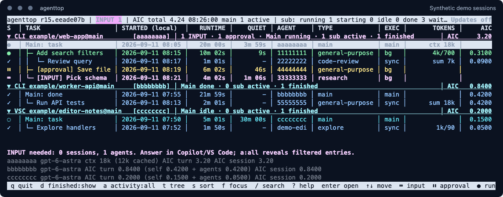

# agenttop

[](https://github.com/daknoblo/agenttop/actions/workflows/checks.yml)

**See what your Copilot agents are doing, what they are waiting for, and what they have consumed.**

agenttop is an `htop`-style terminal dashboard for **GitHub Copilot CLI and VS Code
sessions**. It reads locally recorded events and presents sessions, nested agent
tasks, activity and usage in one place.

[](docs/images/overview.png)

*Real agenttop TUI, captured with generated demo sessions, all activity and
finished agents enabled. Click the image to view it at full size. Colors depend
on your terminal.*

## What you can see

- **Tasks first:** follow agent work in a session tree or a flat table.
- **Main and subagents:** see the session's own work even when no subagent is running.
- **Progress and timing:** start time, runtime, recent activity and completion state.
- **Required input:** magenta questions and yellow approval waits stand out.
- **Agent details:** models, configuration, tool results, timings and available final usage.
- **Consumption:** known AIC totals without adding subagent usage twice.
- **Focused views:** search, session/source filters, active-only and last-two-hour views.
- **Automation:** take a text or JSON snapshot without opening the TUI.

The monitor does not run tasks or answer questions. Continue interacting with
agents in their Copilot or VS Code chat.

## Install

Requires **Python 3.9+** and **Git**. The application uses only the Python
standard library. Interactive mode also requires `curses`, normally included
with Python on macOS and Linux.

### macOS, Linux and WSL

Run this one line in Bash or Zsh:

```sh
(command -v python3 >/dev/null && test ! -e "$HOME/.local/bin/agenttop" && test ! -L "$HOME/.local/bin/agenttop" && git clone --single-branch --branch main https://github.com/daknoblo/agenttop.git "$HOME/.local/share/agenttop" && mkdir -p "$HOME/.local/bin" && ln -s "$HOME/.local/share/agenttop/agenttop" "$HOME/.local/bin/agenttop" && "$HOME/.local/bin/agenttop" --version)
```

Start it:

```sh
"$HOME/.local/bin/agenttop"
```

Add `~/.local/bin` to your `PATH` to use the shorter `agenttop` command.
The installer leaves an existing installation in place; use the updater instead.

**Windows:** use the [PowerShell installer](docs/installation.md#windows-powershell)
for native text/JSON snapshots, or [WSL](docs/installation.md#windows-with-wsl)
for the interactive dashboard.

See [Installation](docs/installation.md) for prerequisites, PATH setup,
local checkouts and uninstalling.

## First steps

```sh
agenttop
```

The default view combines both local sources and starts with `activity:active`:
sessions with running/starting work observed in the last **five minutes**.
All open subagents of those sessions remain visible as context, including idle
agents and entries without a fresh signal. Finished/failed/cancelled entries
remain hidden in this view. Press `a` to select `all` for other sessions and
`d` to include finished work.

Whenever shown, a dimmed `~` marks running/starting entries without a recent
signal. This does not change their recorded status or prove that work has stopped.
An entirely quiet session can still be absent from the active view.
Session sources are labeled **CLI** and **VSC**.

A yellow `!` identifies a recorded VSC subagent-stream subscription error.
Open details for the error code and time. This is a telemetry problem, not an
idle or failed task; the five-minute filter and recorded lifecycle stay unchanged.

Each matching session has a `Main:` row above its subagents. It shows the main
agent's latest recorded activity, model and event time; `main` and `sub` counters
are separate. Main-row AIC is shown only when direct main usage is known, never
copied from the session total.

| Key | Action |
| --- | --- |
| Up/Down or `j`/`k` | Select a session or agent |
| Enter | Expand/collapse a session or open agent details |
| `a` | Cycle active (5-minute signal), last two hours, and all activity |
| `d` | Show/hide finished, failed and cancelled entries |
| `/` | Search |
| `f` | Cycle session focus |
| `t` | Switch tree/flat view |
| `?` | Show keyboard help |
| `q` | Return from details/help, or quit |

Useful starting points:

```sh
agenttop --activity active
agenttop --activity all --all-done
agenttop --activity recent --all-done
agenttop --sort start
agenttop --source cli
agenttop --json
```

The [user guide](docs/usage.md) explains the display, filters, colors and detail view.
JSON snapshots retain their full `activity:all` default; use
`--json --activity active` for a strict five-minute query without the overview's
additional context rows.

## Update

```sh
agenttop -update
```

`--update` is an equivalent alias. The updater applies a fast-forward from
`origin/main`, then exits. Restart the monitor to use the updated version.
It stops rather than discarding local changes or replacing a diverged history.

The TUI checks for updates in the background at startup and every **eight hours**.
Disable that check with `--no-update-check`.
See [updating](docs/installation.md#updating) for requirements and older installations.

## Documentation

| Guide | Covers |
| --- | --- |
| [Installation](docs/installation.md) | Platform setup, one-liners, updates and uninstalling |
| [User guide](docs/usage.md) | Reading the dashboard and working with filters and details |
| [Reference](docs/reference.md) | CLI options, JSON fields, event sources and accounting |
| [Troubleshooting](docs/troubleshooting.md) | Missing sessions, terminal problems and update errors |

## Development

```sh
make test
make check
```

`make test` runs the standard-library regression suite with synthetic fixtures.
`make check` also checks syntax and creates a local JSON snapshot.
Set `PYTHON=/path/to/python3` when using a specific interpreter.

GitHub Actions runs the existing checks on pushes to `main` and on PRs, using
Python 3.9 and 3.14 on Linux. Direct maintainer pushes remain supported.
See [Contributing](CONTRIBUTING.md) for the lightweight workflow and
[Security](SECURITY.md) for security-sensitive reports.

## License

[MIT](LICENSE)

agenttop is an independent project, not an official GitHub product.
