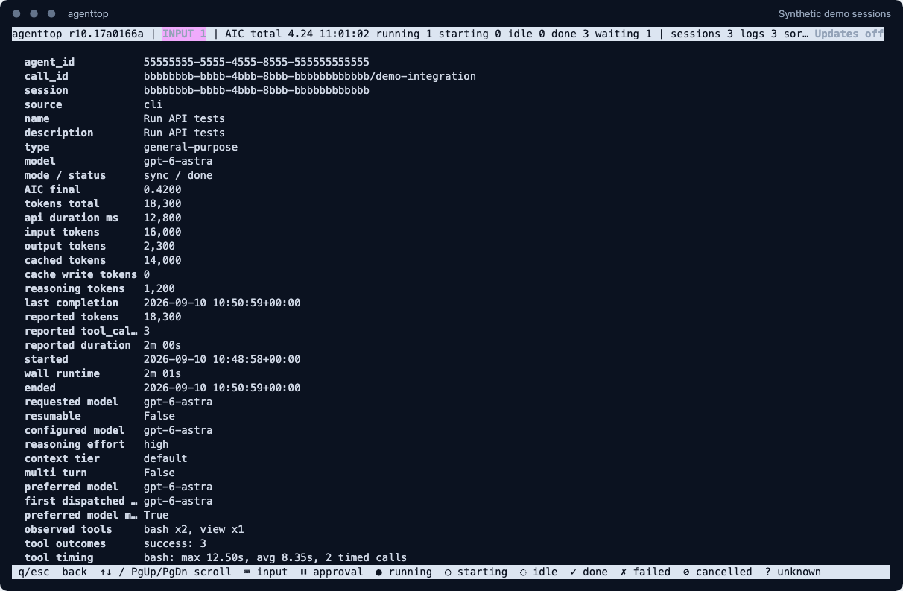

# User guide

[Overview](../README.md) | [Installation](installation.md) | [Reference](reference.md) | [Troubleshooting](troubleshooting.md)

## Open the dashboard

```sh
agenttop
```

The default view combines local Copilot CLI and VS Code sources, groups agents
by session, and hides finished entries. New agents and events appear as logs
are updated.

[](images/overview.png)

*This example has finished entries enabled. The actual TUI was captured with
generated sessions in an isolated demo workspace and update checking disabled.*

## Read the overview

### Header

The top line shows the running version, known AIC consumption and agent counts.
The top-right corner shows the update-check result.

An **`INPUT N`** badge means a loaded session or agent needs an answer.
The badge includes targets hidden by display filters.

### Session groups

A group heading contains the project/branch, source symbol, a short session ID
when space permits, an activity summary and the session's AIC consumption.

The summary counts the displayed agents: active means running or starting.
If no agents are displayed, the heading shows the session's own status.
Select a group and press Enter to collapse or expand it.

Source symbols identify the recorded format, not necessarily the application
that launched the chat:

| Symbol | Source |
| --- | --- |
| `>_` | Copilot CLI-format session history |
| White diamond (`U+25C7`) | VS Code AHP trace without a matching CLI history |

VS Code can also produce CLI-format histories. For matching session IDs,
agenttop prefers the CLI history and supplements it with AHP metadata and UI
input requests.

### Agent rows

The task and its nested delegation tree are on the left. Timing, execution and
usage columns follow. Vertical separators retain the position of empty fields.

| Column | Meaning |
| --- | --- |
| `S` | Recorded lifecycle or waiting state |
| `TASK` | Task description and child-agent hierarchy |
| `STARTED (local)` | First observed delegation/start, in local date and time |
| `RUNTIME` | Wall-clock time since the observed start |
| `QUIET` | Time since the last recorded event |
| `AGENT` | Short agent or call identifier |
| `TYPE` | Agent type, such as `explore` or `code-review` |
| `EXEC` | `background`/`bg`, or blocking `sync` execution |
| `MODEL` | Recorded language model |
| `TOOLS` | Reported completion count when available, otherwise observed calls |
| `TOKENS` | Observed context/output, or `sum N` for reported total usage |
| `AIC` | Known per-agent consumption |

`EXEC` and `MODEL` are independent: background describes how the agent runs,
while the model describes which language model it uses.

Columns adapt to the window. Token/AIC columns appear from 132 columns, models
from 160, and wider fields from 200. Less important columns are hidden when
needed to leave room for the task. Open details for the full available values.

## Recognize states and colors

| State | Meaning |
| --- | --- |
| `starting` | Delegation observed; launch not yet confirmed |
| `running` | Latest events indicate active work |
| `idle` | Waiting between turns; may accept follow-up work |
| `input` | Needs an answer in Copilot/VS Code; magenta with `INPUT` and a keyboard symbol |
| `waiting` | Needs permission approval; yellow with a pause symbol |
| `done` | Successful completion recorded |
| `failed` | Failure recorded |
| `cancelled` | Cancellation recorded or active work closed at session shutdown |
| `unknown` / orphan | Insufficient events to reconstruct the state |

The selected row is highlighted across its full width. Normal session headings
are cyan and underlined. A group also turns magenta when a displayed child needs
input, even if the group is collapsed.

For `INPUT`, answer in the original chat. agenttop shows the wait but does not
submit the response. Ordinary client-side tool execution is not automatically
classified as a question.

Runtime and quiet time are not CPU measurements. An idle resumable agent keeps
its original start time. A crash without a final event can leave the last
recorded status visible.

## Find relevant work

### Activity and finished entries

The footer shows two independent filters:

| Control | Values | Effect |
| --- | --- | --- |
| `a activity` | `all`, `active`, `2h` | No activity restriction; running/starting only; last event within two hours |
| `d finished` | `hide`, `show` | Hide or include done, failed and cancelled entries |

```sh
agenttop --activity active
agenttop --activity recent
agenttop --activity recent --all-done
```

`active` excludes idle, input-waiting and approval-waiting agents.
`2h` uses the last recorded event, not the start time, and can include idle work.
Finished entries still require `d finished:show` or `--all-done`.

To find a hidden input request, cycle `a` back to `all`. Its header badge remains
visible even if the current filter excludes the row.

### Search, source and session

```sh
agenttop --search parser
agenttop --source cli
agenttop --source vscode
agenttop --session aaaaaaaa
```

`aaaaaaaa` is an example ID prefix. Search is case-insensitive and covers task
names/descriptions, types, models and session identifiers/labels.
Press `/` to edit it, Enter to apply and Escape to clear.
Press `f` to cycle session focus, including a return to all sessions.

All filters combine. A matching child keeps its session visible for context.
Sessions without matching children must satisfy the activity filter themselves.

### Sort and change view

```sh
agenttop --sort start
agenttop --flat
```

Press `s` to cycle runtime, start, quiet/idle time, status and name sorting.
`start` shows the newest agents first. Press `t` to switch tree/flat view.
The flat view contains agents only; session-only work remains visible in the tree.

## Inspect an agent

Select an agent and press Enter.

[](images/agent-details.png)

*A completed demo agent with a reported final breakdown. Scroll for additional
tool history and result details.*

Use Up/Down or `j`/`k`, Page Up/Down and Home/End to scroll.
Press `q`, Escape or Left to return.

Depending on the recorded events, details include:

- Full IDs, start/end timestamps with seconds and UTC offset.
- Pending questions and approvals, their waiting time and recorded outcomes.
- Requested, configured and dispatched models, model-change reasons,
  reasoning effort, context tier and multi-turn settings.
- Observed tool calls, failures, recent results and measured average/maximum duration.
- Reported completion duration, total tool calls and total tokens.
- Final per-agent AIC and token breakdowns, when available.

Unavailable optional values are omitted; explicitly reported zeros remain visible.
Some fields require the CLI history or a subscribed AHP subagent channel.

## Understand consumption

- **AIC total** sums reported cumulative usage across all loaded sessions,
  including sessions hidden by filters.
- **AIC known** means some session totals are missing; the sum is incomplete.
- **AIC observed** in details is accumulated recorded request usage.
- **AIC final** is an authoritative per-agent shutdown value, replacing the
  observed sum rather than being added to it.

Subagent usage is already included in session consumption, so it is not added
again to the header total.

`sum N` tokens are a reported input+output total, not context-window size.
Cache and reasoning counts are not added again. The underlying AIC calculation
is `totalNanoAiu / 1e9`; it is not a monetary invoice.

See the [accounting reference](reference.md#usage-accounting) for exact scopes.

## Take a snapshot

```sh
agenttop --once
agenttop --json
agenttop --json --activity recent --hide-done
```

Snapshot modes exit after one read. Redirected standard output also defaults
to a text snapshot; select `--json` explicitly for structured output.
JSON includes finished entries by default unless hidden or filtered out.

See [JSON output](reference.md#json-output) for field definitions.

## Keyboard reference

| Key | Action |
| --- | --- |
| Up/Down, `k`/`j` | Move selection; scroll inside details |
| Enter | Expand/collapse a group or open details |
| `q` | Back from details/help, or quit |
| `/`, Enter, Escape | Edit, apply and clear search |
| `a` | Cycle activity filter |
| `d` | Toggle finished entries |
| `f` | Cycle session focus |
| `s` | Cycle sort |
| `t` | Toggle tree/flat |
| `r` | Refresh and rediscover logs immediately |
| `?` | Open help |
| Page Up/Down, Home/End | Navigate long lists or details |
